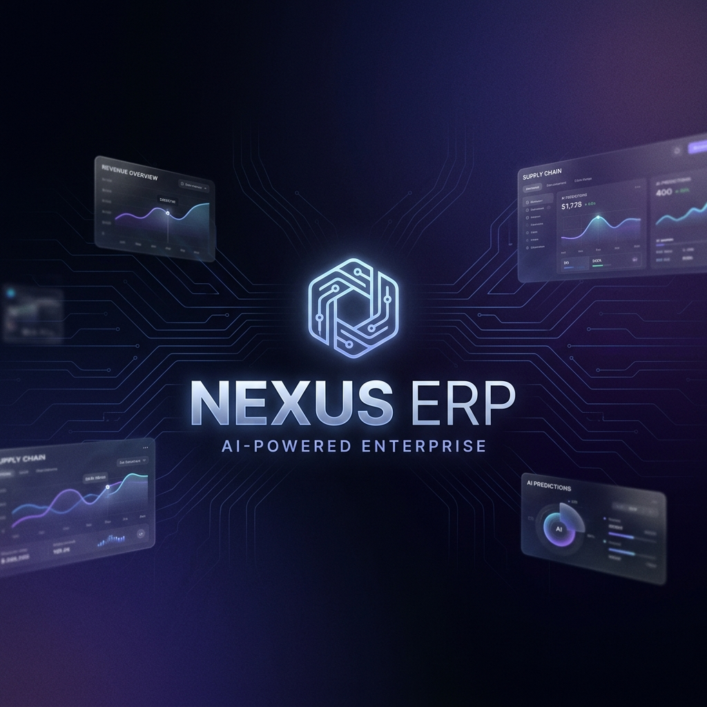

<p align="center">
  
</p>

<p align="center">
  <strong>The AI-Powered Enterprise Resource Platform</strong>
</p>

<p align="center">
  <a href="#architecture"></a>
  <a href="#stack"></a>
  <a href="#stack"></a>
  <a href="#stack"></a>
  <a href="#stack"></a>
  <a href="#license"></a>
</p>

<br />

---

## 🧬 What is Nexus ERP AI?

**Nexus ERP AI** is an enterprise-grade, multi-tenant SaaS platform that unifies your entire business operations — inventory, CRM, finance, HR, and workflows — into a single, AI-augmented command center.

Built from the ground up with **tenant isolation**, **role-based access control**, and **real-time analytics**, Nexus isn't another CRUD app. It's the operating system for modern enterprises.

> **Think:** Linear's design clarity × Stripe's engineering rigor × the ambition of SAP — compressed into one open-source platform.

<br />

## ⚡ Key Features

<table>
<tr>
<td width="50%">

### 🏢 Multi-Tenant Architecture
Complete tenant isolation with JWT-scoped data boundaries. Each organization operates in its own secure namespace — zero data leakage, guaranteed.

### 🔐 Enterprise Security
- JWT access tokens with RSA signing
- Role-based access (ADMIN → MANAGER → HR → SALES → INVENTORY)
- Privilege escalation prevention
- Method-level `@PreAuthorize` guards
- Custom 401/403 JSON responses

### 📦 Inventory Intelligence
Warehouses, products, stock movements — with low-stock alerts, heatmaps, and AI-driven forecasting.

</td>
<td width="50%">

### 🤖 AI Command Center
An AI-powered dashboard that surfaces insights before you ask:
- Revenue trends & forecasts
- Inventory risk detection
- Workforce analytics
- Business health scoring (0-100)

### 🎨 Premium Dark UI
A Linear/Vercel-inspired glassmorphic interface built with:
- Next.js 15 App Router
- Tailwind CSS + ShadCN UI
- Framer Motion animations
- Recharts visualizations

### 📋 Full Audit Trail
Every login, creation, update — logged with userId, tenantId, action, entity, and timestamp. Full enterprise compliance.

</td>
</tr>
</table>

<br />

## 🏗️ Architecture

```
┌─────────────────────────────────────────────────────────────┐
│                        CLIENT                               │
│   Next.js 15 · React 19 · TypeScript · Tailwind · ShadCN    │
│   Framer Motion · Zustand · TanStack Query · Recharts       │
└──────────────────────────┬──────────────────────────────────┘
                           │ HTTPS / JWT Bearer
                           ▼
┌─────────────────────────────────────────────────────────────┐
│                     API GATEWAY                              │
│            Spring Boot 3.5 · Java 21                         │
│  ┌─────────────┐  ┌──────────────┐  ┌────────────────────┐  │
│  │ Auth Module  │  │ Tenant Svc   │  │ Inventory Module   │  │
│  │  JWT Filter  │  │  Isolation   │  │  Products · Stock  │  │
│  │  Login/RBAC  │  │  Multi-tenant│  │  Warehouses        │  │
│  └─────────────┘  └──────────────┘  └────────────────────┘  │
│  ┌─────────────┐  ┌──────────────┐  ┌────────────────────┐  │
│  │ Audit Svc   │  │ User Svc     │  │ Exception Handler  │  │
│  │  Full Trail  │  │  CRUD + RBAC │  │  Global JSON Errs  │  │
│  └─────────────┘  └──────────────┘  └────────────────────┘  │
└──────────────────────────┬──────────────────────────────────┘
                           │ JDBC / Flyway
                           ▼
┌─────────────────────────────────────────────────────────────┐
│                    DATA LAYER                                │
│         PostgreSQL 15 (Docker) · Flyway Migrations           │
│         Spring Data JPA · Hibernate · BCrypt                 │
└─────────────────────────────────────────────────────────────┘
```

<br />

<a id="stack"></a>
## 🛠️ Tech Stack

| Layer | Technology | Purpose |
|-------|-----------|---------|
| **Runtime** | Java 21 | LTS with virtual threads, pattern matching |
| **Framework** | Spring Boot 3.5 | Production-grade backend foundation |
| **Security** | Spring Security + JWT | Authentication & authorization pipeline |
| **Database** | PostgreSQL 15 | Battle-tested relational store |
| **ORM** | Spring Data JPA + Hibernate | Type-safe data access |
| **Migrations** | Flyway | Version-controlled schema evolution |
| **Frontend** | Next.js 15 (App Router) | React server components, streaming |
| **UI** | Tailwind CSS + ShadCN + Framer Motion | Premium glassmorphic dark theme |
| **State** | Zustand + TanStack Query | Client state & server cache |
| **Charts** | Recharts | Data visualization |
| **Container** | Docker Compose | Local development infrastructure |
| **API Docs** | SpringDoc OpenAPI | Swagger UI at `/swagger-ui.html` |

<br />

## 🔒 Security Model

```
   ┌─────────────────────────────────────────────────┐
   │              ROLE HIERARCHY                       │
   │                                                   │
   │   ADMIN ─────────── Full System Access            │
   │     │                                             │
   │   MANAGER ───────── Users (R/W except ADMIN)      │
   │     │                                             │
   │   HR ────────────── HR Module + Users (no ADMIN)  │
   │   FINANCE ───────── Finance Module Only           │
   │   SALES ─────────── Sales Module Only             │
   │   INVENTORY ─────── Inventory Module Only         │
   └─────────────────────────────────────────────────┘
```

**Privilege Escalation Prevention:**
- MANAGER cannot create ADMIN users
- HR cannot create ADMIN users
- SALES and INVENTORY cannot create any users
- Tenant context is **always** derived from JWT — never from request body

<br />

## 🚀 Quick Start

### Prerequisites

| Tool | Version |
|------|---------|
| Java | 21+ |
| Node.js | 20+ |
| Docker | Latest |
| Git | Latest |

### 1. Clone & Setup

```bash
git clone https://github.com/Jawahar08/Nexus-ERP.git
cd Nexus-ERP
```

### 2. Start the Database

```bash
docker compose up -d
```

### 3. Run the Backend

```bash
cd backend

# Set environment variables
export JWT_SECRET="your-secret-key-minimum-32-bytes-long"
export DB_PASSWORD="nexuspassword2026"

# Launch
./mvnw spring-boot:run
```

The API will be live at `http://localhost:8080`

### 4. Run the Frontend

```bash
cd client
npm install --legacy-peer-deps
npm run dev
```

The UI will be live at `http://localhost:3000`

<br />

## 📡 API Reference

### Authentication
```http
POST /api/v1/auth/login
Content-Type: application/json

{
  "tenantSlug": "acme-corp",
  "email": "admin@acme.com",
  "password": "securePassword123"
}
```

**Response:**
```json
{
  "success": true,
  "message": "Login successful",
  "data": {
    "accessToken": "eyJhbGciOiJIUz...",
    "tokenType": "Bearer",
    "expiresIn": 900,
    "userId": "uuid",
    "tenantId": "uuid",
    "tenantSlug": "acme-corp",
    "role": "ADMIN"
  }
}
```

### Core Endpoints
| Method | Endpoint | Auth | Role |
|--------|----------|------|------|
| `POST` | `/api/v1/auth/login` | ❌ | Public |
| `GET` | `/api/v1/health` | ❌ | Public |
| `POST` | `/api/v1/tenants` | ✅ | ADMIN |
| `GET` | `/api/v1/tenants` | ✅ | ADMIN |
| `POST` | `/api/v1/users` | ✅ | ADMIN, MANAGER, HR |
| `GET` | `/api/v1/users` | ✅ | ADMIN, MANAGER, HR |
| `GET` | `/swagger-ui.html` | ❌ | Public |

> 📖 Full interactive API docs available at `/swagger-ui.html` when the backend is running.

<br />

## 📂 Project Structure

```
Nexus-ERP/
├── backend/                          # Spring Boot API
│   ├── src/main/java/com/nexuserp/
│   │   ├── auth/                     # Login, JWT auth flow
│   │   ├── common/                   # ApiResponse, HealthCheck
│   │   ├── config/                   # Security, Password configs
│   │   ├── security/                 # JWT filter, entry points
│   │   ├── tenant/                   # Multi-tenant entities
│   │   └── user/                     # User management + RBAC
│   └── src/main/resources/
│       ├── application.yml
│       └── db/migration/             # Flyway SQL scripts
│
├── client/                           # Next.js Frontend
│   └── src/
│       ├── app/                      # App Router pages
│       │   ├── dashboard/            # Protected routes
│       │   └── login/                # Auth page
│       ├── components/ui/            # Design system
│       │   ├── GlassCard.tsx
│       │   ├── AnimatedButton.tsx
│       │   ├── MetricCard.tsx
│       │   ├── DataTable.tsx
│       │   └── ...
│       └── lib/                      # Utils, theme tokens
│
├── docker-compose.yml                # PostgreSQL 15
└── README.md
```

<br />

## 🗺️ Roadmap

- [x] Multi-tenant architecture
- [x] JWT authentication & authorization
- [x] Role-based access control (6 roles)
- [x] Privilege escalation prevention
- [x] Flyway database migrations
- [x] Audit logging
- [x] Swagger/OpenAPI docs
- [x] Global exception handling
- [x] Design system (GlassCard, AnimatedButton, MetricCard...)
- [ ] AI Command Center dashboard
- [ ] Inventory Intelligence module
- [ ] CRM Sales Pipeline (Kanban)
- [ ] Finance Dashboard
- [ ] HR Experience Center
- [ ] Visual Workflow Builder
- [ ] Refresh token rotation
- [ ] Email verification & password reset
- [ ] Redis caching layer
- [ ] AI recommendation engine

<br />

## 🤝 Contributing

We welcome contributions from the community. Here's how:

1. **Fork** the repo
2. **Create** a feature branch (`git checkout -b feat/amazing-feature`)
3. **Commit** with conventional commits (`git commit -m "feat: add amazing feature"`)
4. **Push** to your branch (`git push origin feat/amazing-feature`)
5. **Open** a Pull Request

<br />

## 📄 License

This project is licensed under the **MIT License** — see the [LICENSE](LICENSE) file for details.

<br />

---

<p align="center">
  <sub>Built with obsessive attention to detail by <a href="https://github.com/Jawahar08">@Jawahar08</a></sub>
</p>

<p align="center">
  <sub>⭐ Star this repo if Nexus ERP impressed you</sub>
</p>
