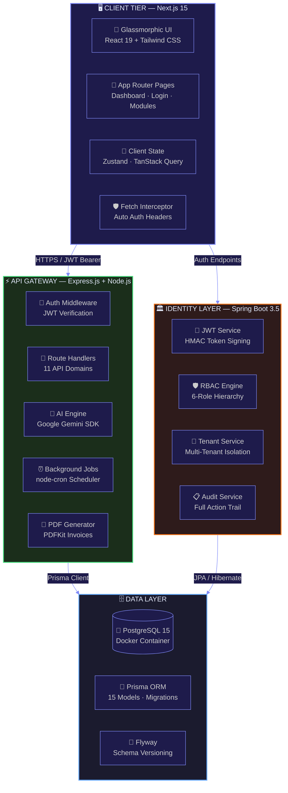
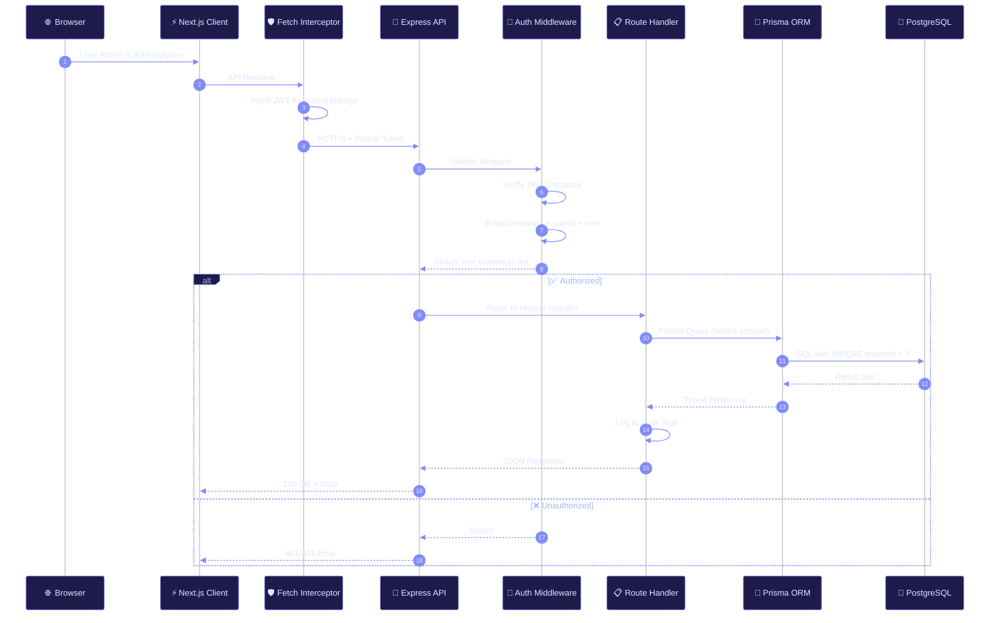
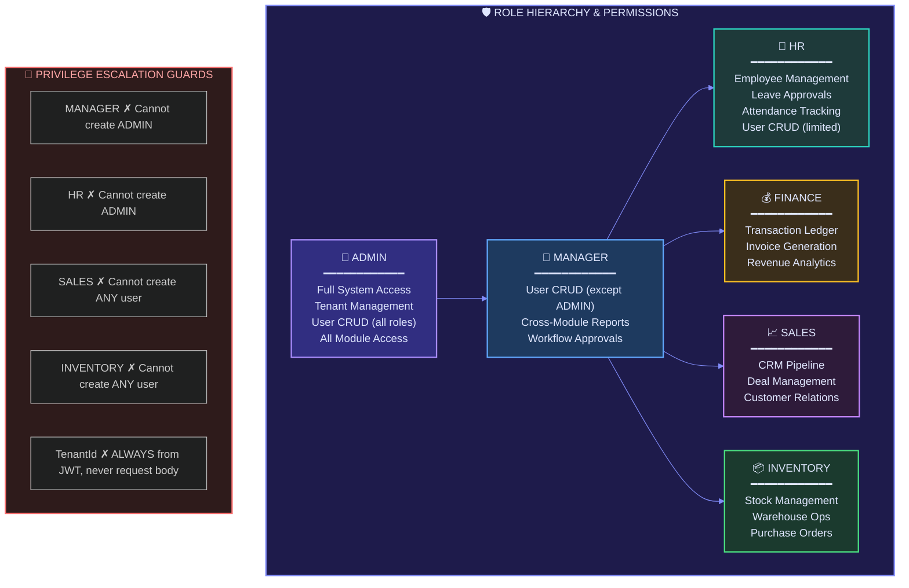
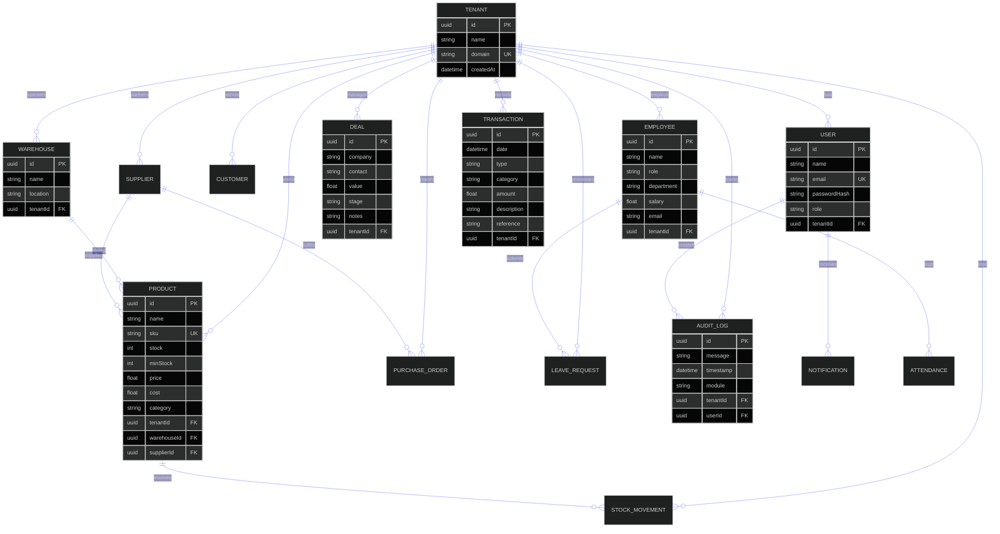
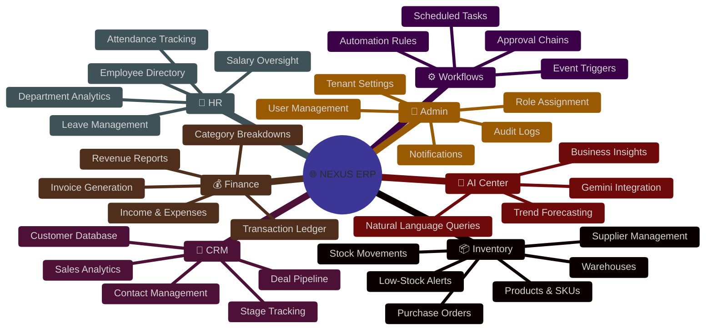
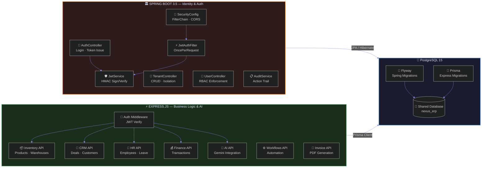
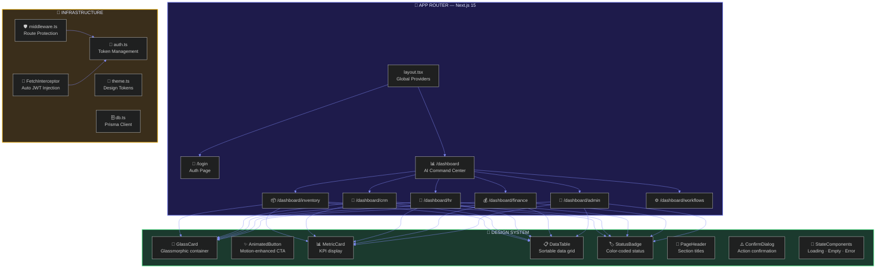
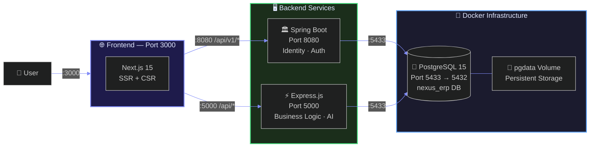
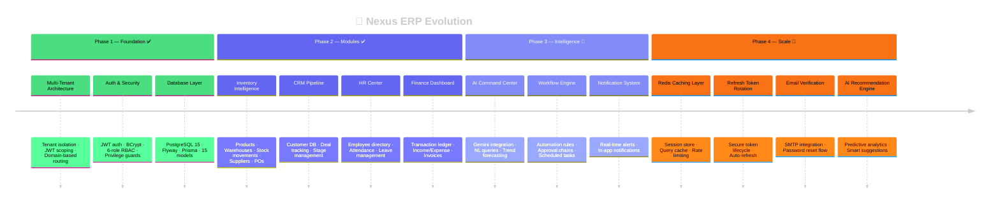

<div align="center">

<!-- ═══════════════════════════════════════════════════════════════════════ -->
<!--                         ANIMATED HEADER                                -->
<!-- ═══════════════════════════════════════════════════════════════════════ -->

<a href="https://github.com/Jawahar08/Nexus-ERP">

</a>

<br />


<br /><br />

<!-- ═══════════════════════════════════════════════════════════════════════ -->
<!--                          ANIMATED BADGES                               -->
<!-- ═══════════════════════════════════════════════════════════════════════ -->

[](https://spring.io/projects/spring-boot)
[](https://nextjs.org/)
[](https://expressjs.com/)
[](https://www.postgresql.org/)
[](https://www.prisma.io/)
[](https://openjdk.org/)
[](https://ai.google.dev/)
[](https://www.docker.com/)
[](LICENSE)

<br />

[](https://github.com/Jawahar08/Nexus-ERP/stargazers)
[](https://github.com/Jawahar08/Nexus-ERP/forks)
[](https://github.com/Jawahar08/Nexus-ERP/issues)
[](https://github.com/Jawahar08/Nexus-ERP/commits)
[](https://github.com/Jawahar08/Nexus-ERP)

<br /><br />


</div>

<!-- ═══════════════════════════════════════════════════════════════════════ -->
<!--                         WHAT IS NEXUS ERP                              -->
<!-- ═══════════════════════════════════════════════════════════════════════ -->

##  What is Nexus ERP AI?

**Nexus ERP AI** is an enterprise-grade, multi-tenant SaaS platform that unifies your entire business operations — **Inventory, CRM, Finance, HR, Workflows, and AI Analytics** — into a single, AI-augmented command center.

Built from the ground up with **tenant isolation**, **role-based access control**, **real-time notifications**, and **Google Gemini AI integration**, Nexus isn't another CRUD app — it's the operating system for modern enterprises.

> [!NOTE]
> **Think:** Linear's design clarity × Stripe's engineering rigor × the ambition of SAP — compressed into one open-source platform, supercharged with AI.

<br />

<!-- ═══════════════════════════════════════════════════════════════════════ -->
<!--                         FEATURE HIGHLIGHTS                             -->
<!-- ═══════════════════════════════════════════════════════════════════════ -->

##  Feature Highlights

<table>
<tr>
<td width="50%" valign="top">

### 🏢 Multi-Tenant Architecture
Complete tenant isolation with JWT-scoped data boundaries. Each organization operates in its own secure namespace — zero data leakage, guaranteed.

### 🔐 Enterprise Security
- JWT access tokens + BCrypt hashing
- Role-based access (6 distinct roles)
- Privilege escalation prevention
- Method-level `@PreAuthorize` guards
- Custom 401/403 JSON error responses

### 📦 Inventory Intelligence
Warehouses, products, stock movements, supplier management — with category analytics and purchase order workflows.

</td>
<td width="50%" valign="top">

### 🤖 AI Command Center (Gemini)
An AI-powered dashboard that surfaces insights before you ask:
- Revenue trends & forecasts
- Inventory risk detection
- Workforce analytics
- Natural language business queries

### 🎨 Premium Dark UI
A Linear/Vercel-inspired glassmorphic interface:
- Next.js 15 App Router + React 19
- Tailwind CSS + Custom design system
- Framer Motion micro-animations
- Recharts data visualizations

### 📋 Full Audit Trail + Notifications
Every action logged with userId, tenantId, module, and timestamp. Real-time notification system for critical events.

</td>
</tr>
</table>

<br />

<!-- ═══════════════════════════════════════════════════════════════════════ -->
<!--                     SYSTEM ARCHITECTURE OVERVIEW                       -->
<!-- ═══════════════════════════════════════════════════════════════════════ -->

<div align="center">

</div>

##  System Architecture

<div align="center">



</div>

<br />

<!-- ═══════════════════════════════════════════════════════════════════════ -->
<!--                      REQUEST LIFECYCLE FLOW                            -->
<!-- ═══════════════════════════════════════════════════════════════════════ -->

##  Request Lifecycle

<div align="center">



</div>

<br />

<!-- ═══════════════════════════════════════════════════════════════════════ -->
<!--                      SECURITY ARCHITECTURE                             -->
<!-- ═══════════════════════════════════════════════════════════════════════ -->

##  Security Architecture

<div align="center">



</div>

<br />

<!-- ═══════════════════════════════════════════════════════════════════════ -->
<!--                       DATABASE SCHEMA (ERD)                            -->
<!-- ═══════════════════════════════════════════════════════════════════════ -->

##  Database Architecture — Entity Relationship Diagram

<div align="center">



</div>

<br />

<!-- ═══════════════════════════════════════════════════════════════════════ -->
<!--                       MODULE ARCHITECTURE                              -->
<!-- ═══════════════════════════════════════════════════════════════════════ -->

##  Module Architecture

<div align="center">



</div>

<br />

<!-- ═══════════════════════════════════════════════════════════════════════ -->
<!--                      DUAL-SERVER ARCHITECTURE                          -->
<!-- ═══════════════════════════════════════════════════════════════════════ -->

##  Dual-Server Architecture

Nexus ERP employs a **dual-backend** strategy — a Spring Boot identity layer for hardened enterprise authentication and an Express.js server for rapid feature development and AI integration.

<div align="center">



</div>

<br />

<!-- ═══════════════════════════════════════════════════════════════════════ -->
<!--                    FRONTEND COMPONENT ARCHITECTURE                     -->
<!-- ═══════════════════════════════════════════════════════════════════════ -->

##  Frontend Component Architecture

<div align="center">



</div>

<br />

<!-- ═══════════════════════════════════════════════════════════════════════ -->
<!--                          TECH STACK TABLE                              -->
<!-- ═══════════════════════════════════════════════════════════════════════ -->

<div align="center">

</div>

##  Tech Stack

<div align="center">

| Layer | Technology | Badge | Purpose |
|:-----:|:----------:|:-----:|:-------:|
| **Runtime** | Java 21 |  | LTS with virtual threads, pattern matching |
| **Backend** | Spring Boot 3.5 |  | Enterprise-grade identity & auth layer |
| **API** | Express.js 4 |  | Rapid business logic & AI integration |
| **Security** | Spring Security + JWT |  | Full authentication pipeline |
| **Database** | PostgreSQL 15 |  | Battle-tested relational store |
| **ORM** | Prisma 5 + Hibernate |  | Type-safe data access across both servers |
| **Migrations** | Flyway + Prisma Migrate |  | Version-controlled schema evolution |
| **AI** | Google Gemini |  | Natural language business insights |
| **Frontend** | Next.js 15 |  | React 19 server components, App Router |
| **Styling** | Tailwind CSS |  | Premium glassmorphic dark theme |
| **Animations** | Framer Motion |  | Micro-animations & page transitions |
| **Charts** | Recharts |  | Data visualization & analytics |
| **PDF** | PDFKit |  | Invoice & report generation |
| **Logging** | Winston |  | Structured server logging |
| **Scheduler** | node-cron |  | Background job scheduling |
| **Container** | Docker Compose |  | Local development infrastructure |

</div>

<br />

<!-- ═══════════════════════════════════════════════════════════════════════ -->
<!--                       DEPLOYMENT ARCHITECTURE                          -->
<!-- ═══════════════════════════════════════════════════════════════════════ -->

##  Deployment Architecture

<div align="center">



</div>

<br />

<!-- ═══════════════════════════════════════════════════════════════════════ -->
<!--                          QUICK START                                   -->
<!-- ═══════════════════════════════════════════════════════════════════════ -->

<div align="center">

</div>

##  Quick Start

### Prerequisites

<div align="center">

| Tool | Version | Badge |
|:----:|:-------:|:-----:|
| Java | 21+ |  |
| Node.js | 20+ |  |
| Docker | Latest |  |
| Git | Latest |  |

</div>

<br />

<details>
<summary><b>📖 Step 1 — Clone & Setup</b></summary>
<br />

```bash
git clone https://github.com/Jawahar08/Nexus-ERP.git
cd Nexus-ERP
```

</details>

<details>
<summary><b>🐳 Step 2 — Start the Database</b></summary>
<br />

```bash
docker compose up -d
```

> This spins up PostgreSQL 15 on port `5433` with persistent volume storage.

</details>

<details>
<summary><b>🏛️ Step 3 — Run the Spring Boot Backend (Identity Layer)</b></summary>
<br />

```bash
cd backend

# Set environment variables
export JWT_SECRET="your-secret-key-minimum-32-bytes-long"
export DB_PASSWORD="nexuspassword2026"

# Launch
./mvnw spring-boot:run
```

> 🟢 API live at `http://localhost:8080`

</details>

<details>
<summary><b>⚡ Step 4 — Run the Express Server (Business Logic)</b></summary>
<br />

```bash
cd server

# Create .env file
cp .env.example .env  # or create manually with DATABASE_URL & JWT_SECRET

# Install dependencies & generate Prisma client
npm install
npx prisma generate

# Launch
npm run dev
```

> 🟢 API live at `http://localhost:5000`

</details>

<details>
<summary><b>🎨 Step 5 — Run the Frontend</b></summary>
<br />

```bash
cd client
npm install --legacy-peer-deps
npm run dev
```

> 🟢 UI live at `http://localhost:3000`

</details>

<br />

<!-- ═══════════════════════════════════════════════════════════════════════ -->
<!--                        API REFERENCE                                   -->
<!-- ═══════════════════════════════════════════════════════════════════════ -->

##  API Reference

<details>
<summary><b>🔑 Authentication — Spring Boot</b></summary>
<br />

```http
POST /api/v1/auth/login
Content-Type: application/json

{
  "tenantSlug": "acme-corp",
  "email": "admin@acme.com",
  "password": "securePassword123"
}
```

**Response:**
```json
{
  "success": true,
  "message": "Login successful",
  "data": {
    "accessToken": "eyJhbGciOiJIUz...",
    "tokenType": "Bearer",
    "expiresIn": 900,
    "userId": "uuid",
    "tenantId": "uuid",
    "tenantSlug": "acme-corp",
    "role": "ADMIN"
  }
}
```

</details>

<details>
<summary><b>📡 Core Endpoints — Spring Boot (Port 8080)</b></summary>
<br />

| Method | Endpoint | Auth | Role |
|:------:|:---------|:----:|:----:|
| `POST` | `/api/v1/auth/login` | ❌ | Public |
| `GET` | `/api/v1/health` | ❌ | Public |
| `POST` | `/api/v1/tenants` | ✅ | ADMIN |
| `GET` | `/api/v1/tenants` | ✅ | ADMIN |
| `POST` | `/api/v1/users` | ✅ | ADMIN, MANAGER, HR |
| `GET` | `/api/v1/users` | ✅ | ADMIN, MANAGER, HR |

</details>

<details>
<summary><b>⚡ Business Endpoints — Express (Port 5000)</b></summary>
<br />

| Method | Endpoint | Module | Description |
|:------:|:---------|:------:|:------------|
| `GET/POST` | `/api/inventory/*` | 📦 | Products, Warehouses, Stock, Suppliers |
| `GET/POST` | `/api/crm/*` | 💼 | Customers, Deals, Pipeline |
| `GET/POST` | `/api/hr/*` | 👥 | Employees, Attendance, Leave |
| `GET/POST` | `/api/finance/*` | 💰 | Transactions, Revenue |
| `GET/POST` | `/api/invoices/*` | 📄 | PDF Invoice Generation |
| `GET/POST` | `/api/workflows/*` | ⚙️ | Automation Rules |
| `GET/POST` | `/api/ai/*` | 🤖 | Gemini AI Insights |
| `GET/POST` | `/api/admin/*` | 🔐 | User & Tenant Management |
| `GET` | `/api/notifications/*` | 🔔 | Notification Feed |
| `GET` | `/api/audit/*` | 📋 | Audit Trail Logs |

</details>

<br />

<!-- ═══════════════════════════════════════════════════════════════════════ -->
<!--                       PROJECT STRUCTURE                                -->
<!-- ═══════════════════════════════════════════════════════════════════════ -->

##  Project Structure

```
Nexus-ERP/
│
├── 🏛️ backend/                           # Spring Boot — Identity & Auth Layer
│   ├── src/main/java/com/nexuserp/
│   │   ├── auth/                         # AuthController · AuthService · DTOs
│   │   ├── common/                       # ApiResponse · HealthCheck
│   │   ├── config/                       # SecurityConfig · PasswordConfig
│   │   ├── security/                     # JwtService · JwtFilter · EntryPoints
│   │   ├── tenant/                       # Tenant CRUD · Isolation · Status
│   │   └── user/                         # User CRUD · RBAC Enforcement
│   └── src/main/resources/
│       ├── application.yml               # App configuration
│       └── db/migration/                 # Flyway SQL scripts
│
├── ⚡ server/                             # Express.js — Business Logic & AI
│   ├── prisma/
│   │   ├── schema.prisma                 # 15 models · Full ERD
│   │   └── seed.ts                       # Demo data seeder
│   └── src/
│       ├── index.js                      # Express app bootstrap
│       ├── middleware/auth.js            # JWT verification middleware
│       ├── lib/logger.js                 # Winston structured logging
│       ├── services/
│       │   ├── scheduler.js              # node-cron background jobs
│       │   └── pdf.js                    # PDFKit invoice generator
│       └── routes/
│           ├── auth.js                   # Login · Registration
│           ├── inventory.js              # Products · Warehouses · Stock
│           ├── crm.js                    # Deals · Customers
│           ├── hr.js                     # Employees · Leave · Attendance
│           ├── finance.js                # Transactions · Revenue
│           ├── invoices.js               # PDF Invoice generation
│           ├── workflows.js              # Automation rules
│           ├── ai.js                     # Gemini AI integration
│           ├── admin.js                  # User & tenant management
│           ├── notifications.js          # Real-time alerts
│           └── audit.js                  # Action trail logs
│
├── 🎨 client/                            # Next.js 15 — Premium Dark UI
│   └── src/
│       ├── middleware.ts                 # Route protection guard
│       ├── app/
│       │   ├── layout.tsx               # Root layout + providers
│       │   ├── login/page.tsx           # Glassmorphic auth page
│       │   └── dashboard/
│       │       ├── layout.tsx           # Sidebar + top nav
│       │       ├── page.tsx             # AI Command Center
│       │       ├── inventory/           # 📦 Inventory Intelligence
│       │       ├── crm/                 # 💼 Sales Pipeline
│       │       ├── hr/                  # 👥 HR Experience Center
│       │       ├── finance/             # 💰 Finance Dashboard
│       │       ├── admin/               # 🔐 Admin Panel
│       │       └── workflows/           # ⚙️ Workflow Builder
│       ├── components/
│       │   ├── FetchInterceptor.tsx      # Auto JWT injection
│       │   └── ui/
│       │       ├── GlassCard.tsx         # Glassmorphic container
│       │       ├── AnimatedButton.tsx    # Motion-enhanced CTA
│       │       ├── MetricCard.tsx        # KPI metric display
│       │       ├── DataTable.tsx         # Sortable data grid
│       │       ├── StatusBadge.tsx       # Color-coded status
│       │       ├── PageHeader.tsx        # Section headers
│       │       ├── ConfirmDialog.tsx     # Action confirmation
│       │       └── StateComponents.tsx   # Loading · Empty · Error
│       └── lib/
│           ├── auth.ts                  # Token management
│           ├── theme.ts                 # Design tokens
│           ├── db.ts                    # Prisma client
│           └── utils.ts                 # Shared utilities
│
├── 🐳 docker-compose.yml                # PostgreSQL 15 container
└── 📖 README.md                         # You are here ✨
```

<br />

<!-- ═══════════════════════════════════════════════════════════════════════ -->
<!--                            ROADMAP                                     -->
<!-- ═══════════════════════════════════════════════════════════════════════ -->

<div align="center">

</div>

##  Roadmap

<div align="center">



</div>

<br />

<!-- ═══════════════════════════════════════════════════════════════════════ -->
<!--                         CONTRIBUTING                                   -->
<!-- ═══════════════════════════════════════════════════════════════════════ -->

##  Contributing

We welcome contributions from the community! Here's how:

```
  ┌──────────────────────────────────────────────────────────────┐
  │                                                              │
  │   1.  🍴  Fork the repo                                     │
  │   2.  🌿  Create a feature branch                           │
  │           git checkout -b feat/amazing-feature               │
  │   3.  💾  Commit with conventional commits                   │
  │           git commit -m "feat: add amazing feature"          │
  │   4.  🚀  Push to your branch                               │
  │           git push origin feat/amazing-feature               │
  │   5.  🔀  Open a Pull Request                               │
  │                                                              │
  └──────────────────────────────────────────────────────────────┘
```

<br />

<!-- ═══════════════════════════════════════════════════════════════════════ -->
<!--                           LICENSE                                      -->
<!-- ═══════════════════════════════════════════════════════════════════════ -->

##  License

This project is licensed under the **MIT License** — see the [LICENSE](LICENSE) file for details.

<br />

<!-- ═══════════════════════════════════════════════════════════════════════ -->
<!--                            FOOTER                                      -->
<!-- ═══════════════════════════════════════════════════════════════════════ -->

<div align="center">


<br />


<br />

**[@Jawahar08](https://github.com/Jawahar08)**

<br />

[](https://github.com/Jawahar08)
[](https://github.com/Jawahar08/Nexus-ERP)

<br />

<sub>If Nexus ERP impressed you, a ⭐ would mean the world</sub>

</div>
